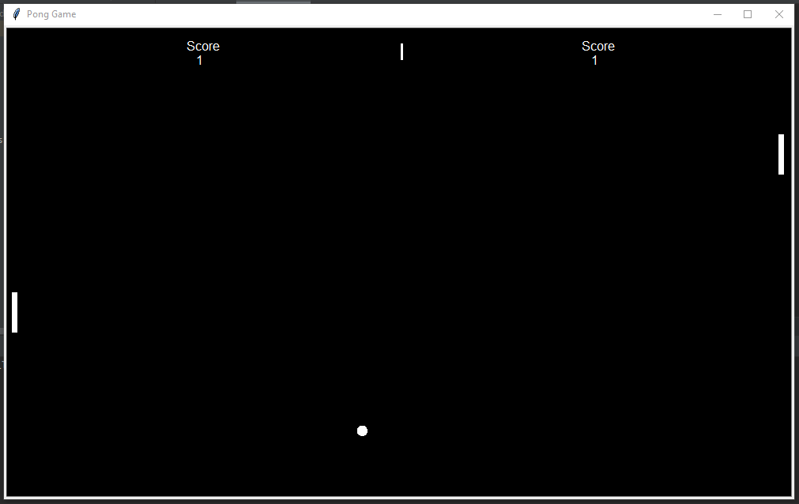

# Ping-Pong-game
It is a simple Ping-Pong game created using python and tturtle module. It is a multiplayer game where one player controls the paddle using arrow buttons and the other player controls the paddle using 'A, W, S, D' letter buttons. As the game progresses the speed of the ball also increases and so the difficult level also increases which makes it more challenging to play. 

## Technologies
- Python
- Turtle
- Tkinter

## Preview

